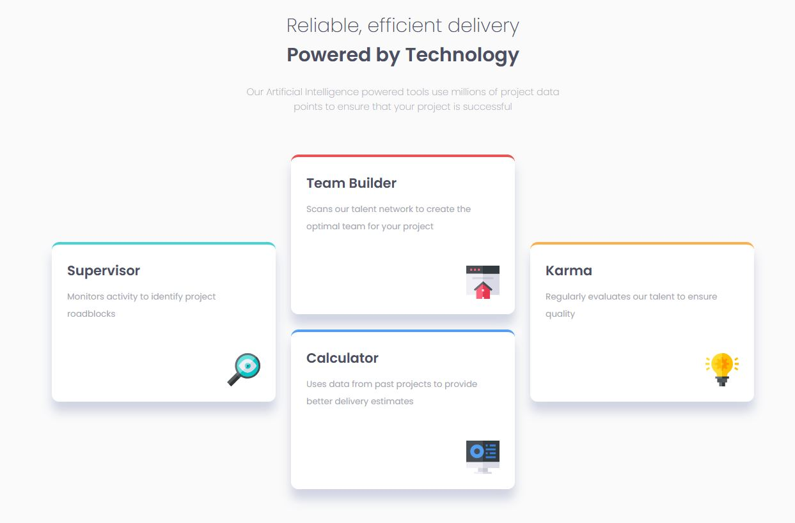

# Frontend Mentor - Four card feature section solution

This is a solution to the [Four card feature section challenge on Frontend Mentor](https://www.frontendmentor.io/challenges/four-card-feature-section-weK1eFYK). Frontend Mentor challenges help you improve your coding skills by building realistic projects. 

## Table of contents

- [Overview](#overview)
  - [The challenge](#the-challenge)
  - [Screenshot](#screenshot)
  - [Links](#links)
- [My process](#my-process)
  - [Built with](#built-with)
  - [What I learned](#what-i-learned)
  - [Continued development](#continued-development)
  - [Useful resources](#useful-resources)
- [Author](#author)

## Overview

### The challenge

Users should be able to:

- View the optimal layout for the site depending on their device's screen size

### Screenshot




### Links

- Solution URL: [Github URL](https://your-solution-url.com)
- Live Site URL: [Live site URL](https://your-live-site-url.com)

## My process

### Built with

- Semantic HTML5 markup
- CSS custom properties
- Flexbox
- CSS Grid
- Mobile-first workflow

### What I learned

Using grid for special layouts
```css
    .cards-container {
        display:grid;
        min-width: fit-content;
    }

    .feature-card--supervisor {
        grid-column:  1 / 2;
        grid-row: 2 / 4;
    }
```

### Continued development

I'm not sure whether i got borders right. Probably should fix that later.

### Useful resources

- [Grid tutorial \ Cheatsheet](https://habr.com/ru/company/macloud/blog/564182/) - Helped me making a grid layout for the biggest screen.

## Author

- Frontend Mentor - [@Quakumei](https://www.frontendmentor.io/profile/Quakumei)
- Github - [@Quakumei](https://github.com/Quakumei)
